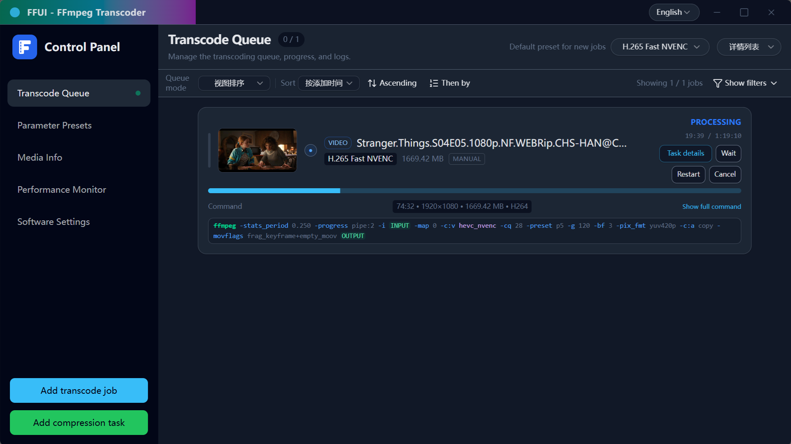
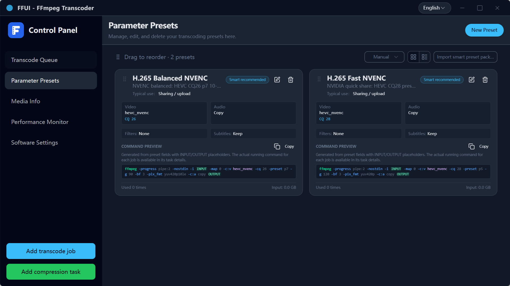
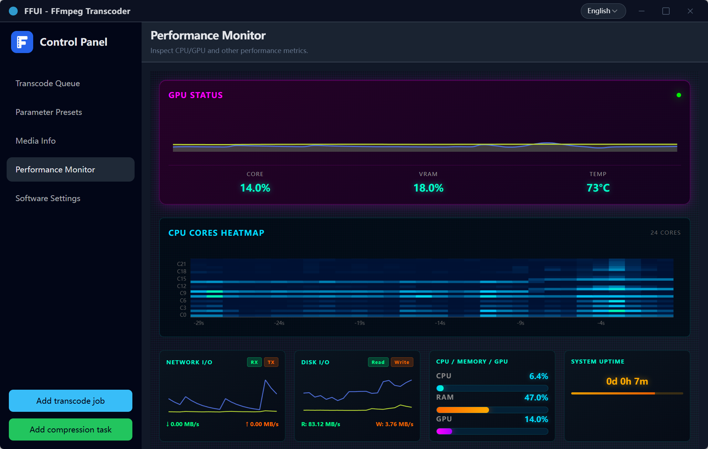
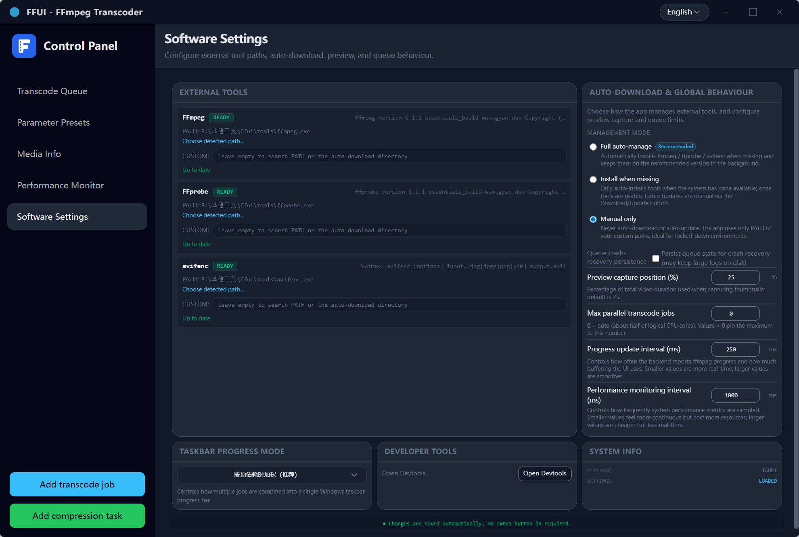
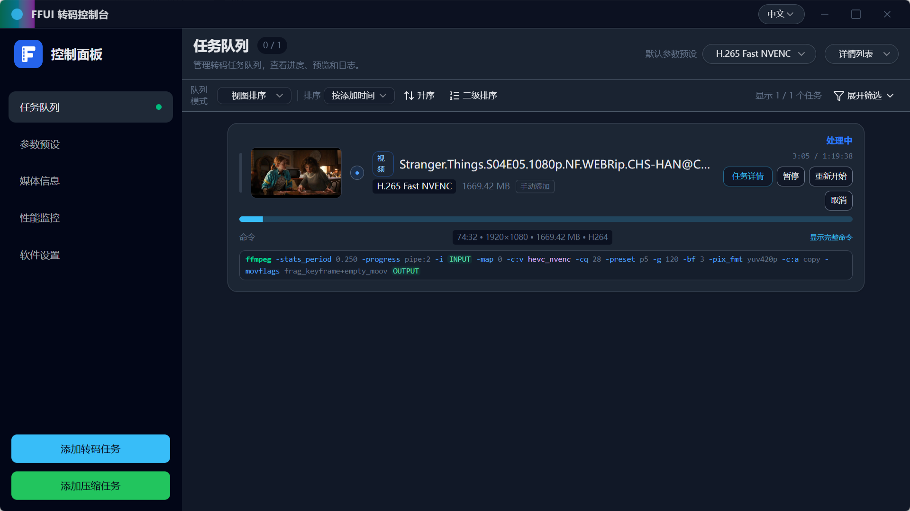
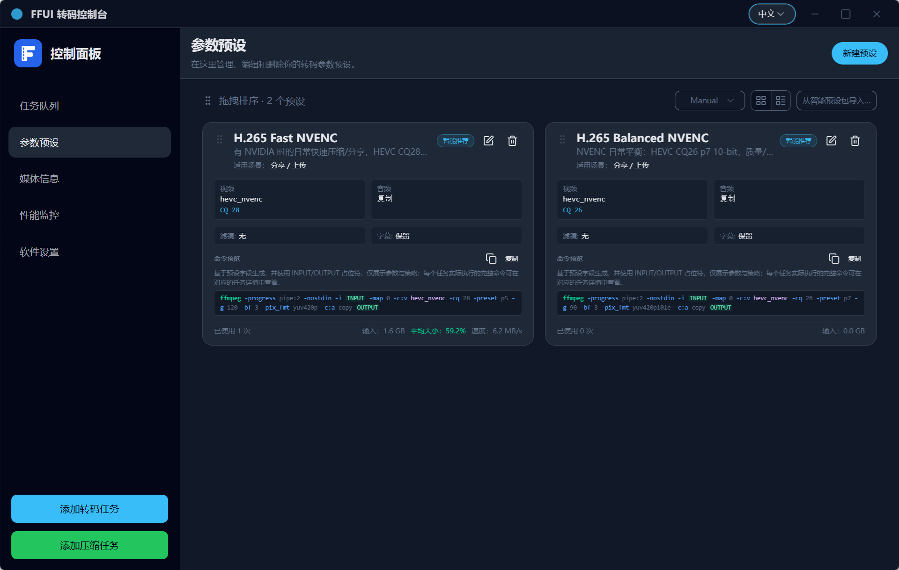
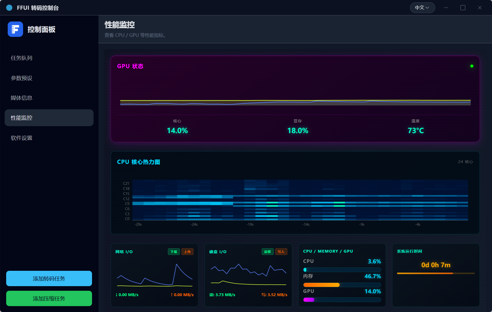
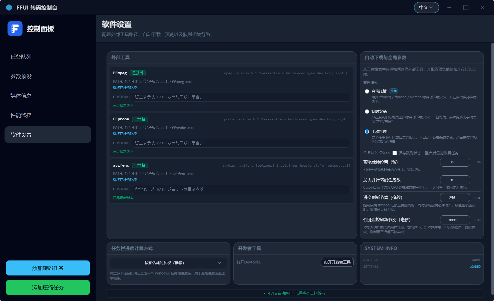

#  FFUI

> For the Chinese version, see [中文说明](#项目简介).


## Overview

FFUI is a desktop user interface for FFmpeg-based transcoding, built with Tauri 2 (Rust) and Vue 3. It focuses on queue-centric workflows, reusable presets, basic media inspection, and an optional system performance monitor.

## Features

- Transcode queue: add manual jobs or collect candidates via Smart Scan, track progress and status, and review logs for each job.
- Presets: define and reuse FFmpeg presets for video, image, and audio workloads.
- Smart Scan (auto-compress): scan a folder for media files that match simple size/codec rules and enqueue a batch of jobs.
- Media info: inspect a single file and display structured metadata and analysis from the backend.
- System performance monitor: chart CPU, memory, disk I/O, network I/O, and optional NVIDIA GPU metrics sampled on the Rust side.
- Settings and external tools: configure FFmpeg / FFprobe / avifenc paths, auto-download behaviour, preview capture settings, concurrency limits, metrics interval, and queue crash-recovery mode.

## Screenshots









## Technology stack

- Frontend: Vue 3, TypeScript, Vite, Tailwind-style styling, vue-i18n, charts via ApexCharts / ECharts.
- Backend: Tauri 2 with Rust 2024 edition, queue and preset engine under `src-tauri/src/ffui_core`.
- Monitoring: system metrics gathered with `sysinfo`, optional GPU metrics via `nvml-wrapper`.

## Prerequisites

To build and run the desktop app you need:

- A Rust toolchain (stable) with Cargo.
- Node.js and npm.
- The Tauri 2 CLI and its platform-specific prerequisites (see the Tauri documentation).

## Getting started

Clone this repository and install the JavaScript dependencies:

```bash
npm install
```

### Frontend-only development

Run the Vite dev server and open the web UI in a browser:

```bash
npm run dev
# default: http://localhost:5188
```

### Desktop app development (Tauri)

Build the frontend and start the Tauri dev window:

```bash
npm run tauri:dev
# equivalent to: npm run build && tauri dev
```

Tauri attaches to the dev server at `http://localhost:5188` as configured in `tauri.conf.json` and `vite.config.ts`.

### Building

Build the production frontend bundle:

```bash
npm run build
```

Build the Rust backend and desktop bundle:

```bash
cd src-tauri
cargo build        # debug build
cargo build --release
```

On platforms where the Tauri CLI is available you can also build a desktop bundle from the repo root:

```bash
npm run build:exe
```

## Testing

The repository contains unit tests for both the frontend and the Rust backend.

- Frontend tests (Vitest):

```bash
npm test
# or
npm run test
```

- Backend tests (Rust):

```bash
cd src-tauri
cargo test
```

## Directory layout

- `src/` – Vue 3 frontend.
  - `components/` – UI components and panels (queue, presets, media, monitor, settings, dialogs).
  - `composables/` – state and behaviour hooks (queue operations, smart scan, system metrics, settings, etc.).
  - `lib/` – frontend helpers such as backend bindings, FFmpeg command rendering, and preset utilities.
  - `locales/` – i18n resources for English and Simplified Chinese.
- `src-tauri/` – Tauri 2 Rust backend.
  - `src/ffui_core/` – transcoding engine, presets, smart scan, settings, external tools, and monitoring logic.
  - `src/commands/` – Tauri commands exposed to the frontend.
  - `src/system_metrics.rs` – system metrics sampler and history buffer.
- `docs/` – notes about FFmpeg parameter space and internal design.
- `public/` – static assets.
- `dist/` – production frontend build output (generated).
- `scripts/` – helper scripts for development and build.

## System performance monitoring

The app includes a “Monitor” tab that displays system metrics from the Rust backend.

### Backend sampling configuration

System metrics are sampled in `src-tauri/src/system_metrics.rs` using `sysinfo` and optionally NVML. Sampling behaviour can be tuned through environment variables:

- `FFUI_METRICS_INTERVAL_MS`  
  Base sampling interval in milliseconds. The sampler always uses this interval (or the user-configured value in `AppSettings`) between snapshots.  
  Default: `1000`.

- `FFUI_METRICS_IDLE_INTERVAL_MS`  
  Reserved for potential future “idle” throttling when no subscribers are present. The current implementation does not use this value directly.  
  Default: `5000`.

- `FFUI_METRICS_HISTORY_CAPACITY`  
  Maximum number of snapshots kept in the in-memory ring buffer. Older entries are dropped when the limit is exceeded.  
  Default: `600` (roughly 10 minutes at 1s intervals).

- `FFUI_METRICS_MAX_DISKS`  
  Maximum number of disk devices to keep in the I/O metrics list.  
  Default: `6`.

- `FFUI_METRICS_MAX_INTERFACES`  
  Maximum number of network interfaces to keep in the metrics list.  
  Default: `6`.

The effective sampling interval may also be overridden at runtime via the `metrics_interval_ms` field in `AppSettings`, which is controlled from the Settings panel.

### Frontend metrics panel

The `Monitor` tab is implemented with:

- `useSystemMetrics` (`src/composables/useSystemMetrics.ts`), which:
  - subscribes to the `system-metrics://update` event in Tauri mode;
  - keeps a bounded snapshot history (default length 600);
  - falls back to a mock data stream in pure web / test environments.
- `MonitorPanelPro.vue` (`src/components/panels/MonitorPanelPro.vue`), which renders:
  - overall CPU utilisation and per-core heatmaps (up to 32 cores);
  - memory usage;
  - aggregated disk read/write throughput;
  - per-interface network throughput;
  - optional NVIDIA GPU usage and memory usage when available.

## External tools and FFmpeg

FFUI does not ship its own codecs. It relies on external command-line tools:

- `ffmpeg`
- `ffprobe`
- `avifenc`

The backend can use binaries found on the system `PATH` or, when auto-download is enabled, fetch static builds from configured sources and record basic metadata. Configuration for these tools, including custom paths and auto-download behaviour, is managed through the Settings panel and stored in `AppSettings`.

The exact download sources and policies are implemented in `src-tauri/src/ffui_core/tools/`.

## License

This project is licensed under the MIT License. See `LICENSE` for details.

---

## 项目简介

FFUI 是一个围绕 FFmpeg 的桌面转码界面，基于 Tauri 2（Rust）和 Vue 3 实现。应用围绕“任务队列 + 参数预设”的流程设计，同时提供基础的媒体信息查看和系统性能监控功能，方便在本地机器上管理批量转码工作。

## 功能概览

- 任务队列：添加手动转码任务或通过批量压缩扫描目录，查看进度、状态和日志。
- 参数预设：为视频、图片和音频配置 FFmpeg 预设，并在队列中重复使用。
- 批量压缩：按目录扫描媒体文件，基于体积和编码规则筛选候选文件并批量加入队列。
- 媒体信息：针对单个文件查看由后端返回的结构化元数据和分析结果。
- 性能监控：在“性能监控”页中查看 CPU、内存、磁盘 I/O、网络 I/O 以及可选的 NVIDIA GPU 指标。
- 设置与外部工具：在设置页管理 `ffmpeg` / `ffprobe` / `avifenc` 路径和自动下载策略，并配置预览截帧位置、并行任务上限、性能采样间隔和队列崩溃恢复模式等行为。

## 界面截图









## 技术栈

- 前端：Vue 3、TypeScript、Vite、Tailwind 风格样式、vue-i18n，图表使用 ApexCharts / ECharts。
- 后端：Tauri 2 + Rust 2024，队列和预设引擎位于 `src-tauri/src/ffui_core`。
- 监控：系统指标通过 `sysinfo` 采样，在支持的环境下使用 `nvml-wrapper` 获取 GPU 指标。

## 环境依赖

构建并运行桌面应用需要：

- 已安装的 Rust 工具链（稳定版）及 Cargo。
- Node.js 与 npm。
- Tauri 2 CLI 以及平台相关依赖（可参考 Tauri 官方文档）。

## 快速开始

在仓库根目录执行：

```bash
npm install
```

### 仅运行前端（浏览器）

```bash
npm run dev
# 默认开发地址： http://localhost:5188
```

### 运行桌面应用（Tauri）

```bash
npm run tauri:dev
# 等价于：npm run build && tauri dev
```

Tauri 会连接到 `tauri.conf.json` 和 `vite.config.ts` 中配置的 `http://localhost:5188` 前端开发服务。

### 构建

构建生产环境前端资源：

```bash
npm run build
```

单独构建 Rust 后端：

```bash
cd src-tauri
cargo build          # 调试构建
cargo build --release
```

在支持 Tauri CLI 的平台上，也可以从仓库根目录构建桌面可执行包：

```bash
npm run build:exe
```

## 测试

仓库包含前端和后端的单元测试。

- 前端（Vitest）：

```bash
npm test
# 或
npm run test
```

- 后端（Rust）：

```bash
cd src-tauri
cargo test
```

## 目录结构

- `src/`：前端代码。
  - `components/`：界面组件与面板（队列、预设、媒体、监控、设置、弹窗等）。
  - `composables/`：状态与逻辑封装（队列操作、批量压缩、系统监控、设置等）。
  - `lib/`：前端辅助库，例如后端调用封装、FFmpeg 命令渲染、预设工具函数。
  - `locales/`：中英文文案资源。
- `src-tauri/`：Tauri 2 Rust 后端。
  - `src/ffui_core/`：转码引擎、预设管理、批量压缩、设置、外部工具和监控逻辑。
  - `src/commands/`：暴露给前端的 Tauri 命令。
  - `src/system_metrics.rs`：系统性能采样与历史缓冲。
- `docs/`：与 FFmpeg 参数空间相关的参考文档和内部笔记。
- `public/`：静态资源。
- `dist/`：前端构建输出（自动生成）。
- `scripts/`：开发与构建辅助脚本。

## 系统性能监控

应用包含一个“性能监控”页签，用于展示由 Rust 后端采样的系统指标。

### 后端采样配置

系统指标在 `src-tauri/src/system_metrics.rs` 中通过 `sysinfo` 和可选的 NVML 采样。采样行为可以通过以下环境变量调整：

- `FFUI_METRICS_INTERVAL_MS`  
  采样基础间隔（毫秒）。采样线程在每次快照之间始终按该间隔（或设置中的覆盖值）休眠。  
  默认：`1000`。

- `FFUI_METRICS_IDLE_INTERVAL_MS`  
  预留给“空闲状态降频”之类的策略，目前实现不会实际使用该值。  
  默认：`5000`。

- `FFUI_METRICS_HISTORY_CAPACITY`  
  环形缓冲区中保留的最大快照条数，超出上限时丢弃最旧数据。  
  默认：`600`（按 1 秒采样约 10 分钟历史）。

- `FFUI_METRICS_MAX_DISKS`  
  磁盘 I/O 指标中保留的设备数量上限。  
  默认：`6`。

- `FFUI_METRICS_MAX_INTERFACES`  
  网络 I/O 指标中保留的网卡数量上限。  
  默认：`6`。

此外，设置中的 `metrics_interval_ms` 字段也可以在运行时覆盖采样间隔，可通过设置页进行调整。

### 前端性能面板

性能监控相关前端代码主要包括：

- `useSystemMetrics`（`src/composables/useSystemMetrics.ts`）：
  - 在 Tauri 模式下订阅 `system-metrics://update` 事件；
  - 维护一个有上限的历史快照（默认长度 600）；
  - 在纯 Web / 测试环境下使用模拟数据源。
- `MonitorPanelPro.vue`（`src/components/panels/MonitorPanelPro.vue`）：
  - 展示整体 CPU 利用率与最多 32 个核心的热力图；
  - 展示内存占用；
  - 展示聚合磁盘读写吞吐；
  - 展示按接口分组的网络吞吐；
  - 在可用时展示 NVIDIA GPU 利用率和显存使用率。

## 外部工具与 FFmpeg

FFUI 不自带编解码器实现，依赖外部命令行工具：

- `ffmpeg`
- `ffprobe`
- `avifenc`

后端可以使用系统 `PATH` 中已有的可执行文件，也可以在开启自动下载后，根据设置从外部来源获取静态构建版本，并记录基本元数据。相关配置（自定义路径、自动下载策略等）通过设置页管理，并保存在 `AppSettings` 中。

具体的下载来源和策略实现位于 `src-tauri/src/ffui_core/tools/` 下的代码中，可按需要自行查看。

## 许可证

本项目采用 MIT 许可证，详情见仓库中的 `LICENSE` 文件。
