#  FFUI — FFmpeg GUI

> For the Chinese version, see [中文说明](#项目简介).

<div align="center">
  <a href="https://github.com/muyuanjin/ffui/releases"></a>
  <a href="https://github.com/muyuanjin/ffui/releases"></a>
  <a href="https://github.com/muyuanjin/ffui/actions/workflows/release.yml"></a>
  <a href="LICENSE"></a>
</div>

<div align="center">
  <a href="https://github.com/muyuanjin/ffui/releases"></a>
</div>

> FFUI is under active development. Bug reports, feature requests, and contributions are welcome — please use [GitHub Issues](https://github.com/muyuanjin/ffui/issues) or open a [pull request](https://github.com/muyuanjin/ffui/pulls).

## Overview

FFUI is a friendly desktop app for converting and compressing videos (and audio/images) in batches. Drag files into a queue, pick a preset, and start — no FFmpeg command line needed. It’s built around a queue workflow, preset management with stats, and quick input/output comparison. If you already know FFmpeg, every preset is still fully editable and reusable.

## Quickstart (using the app)

1. Download the latest release from GitHub Releases and launch FFUI.
2. On the first launch, the preset setup wizard helps you import a starter set of FFmpeg presets; you can reopen it later from Presets → “Import recommended preset pack…” to import more.
3. Drag files into the queue, choose a preset, and start.

Tip: if you don’t have FFmpeg installed, enable auto-download/auto-update in Settings → External tools.

## Features

- Queue-first workflow: add jobs, track progress and status, and review per-job logs (with optional crash recovery).
- Presets (with stats): manage reusable presets and see usage, average compression ratio, and speed stats.
- Input vs output compare: side-by-side playback or frame snapshots to quickly spot quality differences.
- FFmpeg management: auto-download/auto-update FFmpeg (plus `ffprobe` / `avifenc`) or point to your own binaries.
- Batch scan (auto-compress): scan a folder for media files that match simple size/codec rules and enqueue a batch of jobs.
- Media info: inspect a single file and display structured metadata and analysis from the backend.
- System performance monitor: chart CPU, memory, disk I/O, network I/O, and optional NVIDIA GPU metrics sampled on the Rust side.
- Settings: configure output rules, UI appearance, preview capture settings, concurrency limits, and more.

## Screenshots

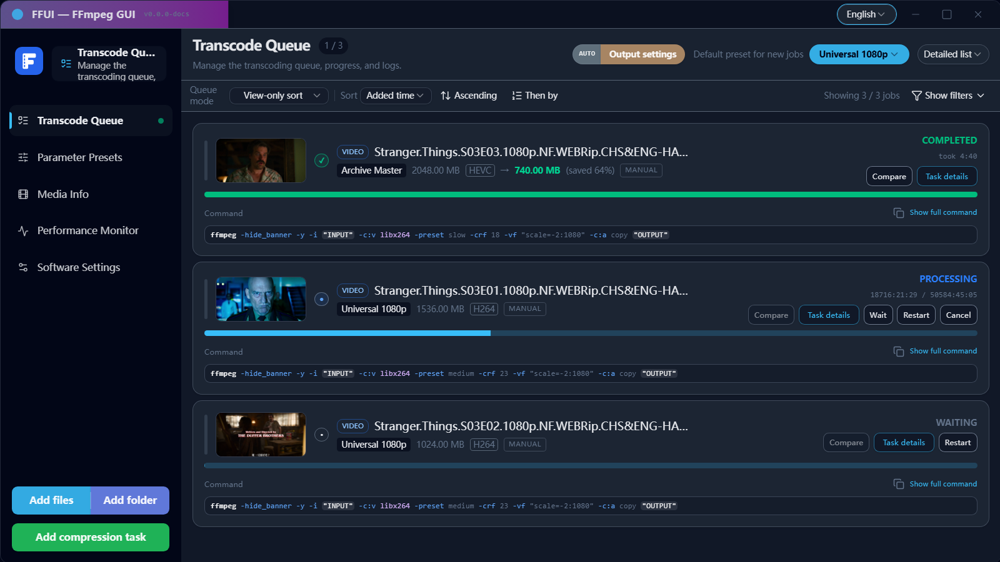

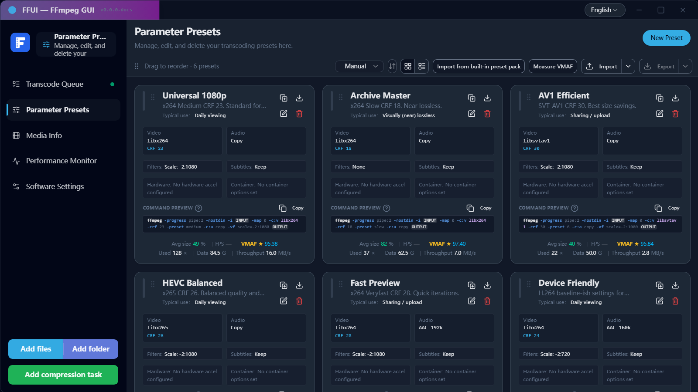

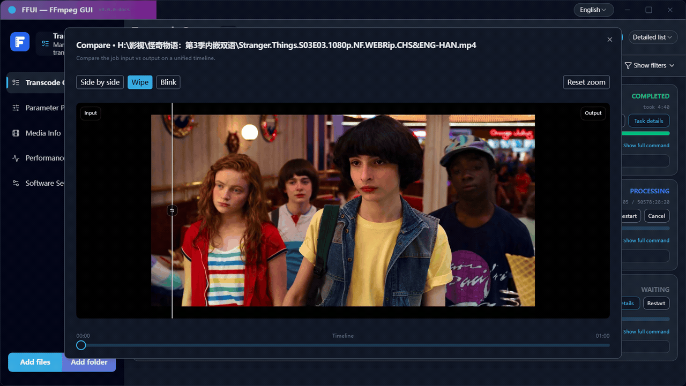

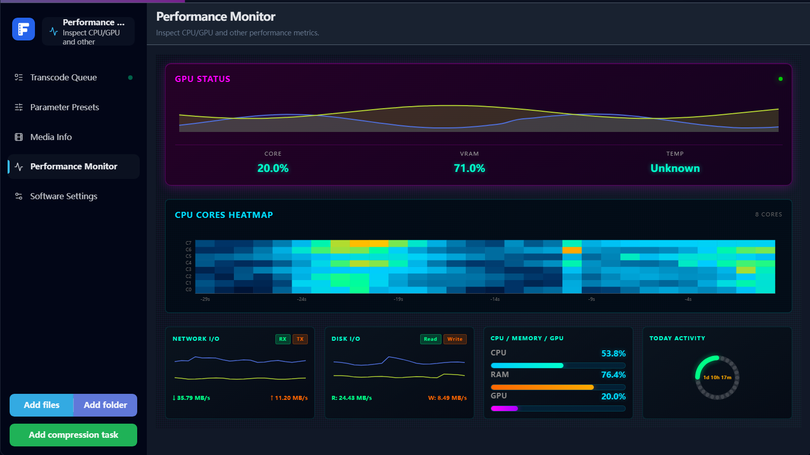

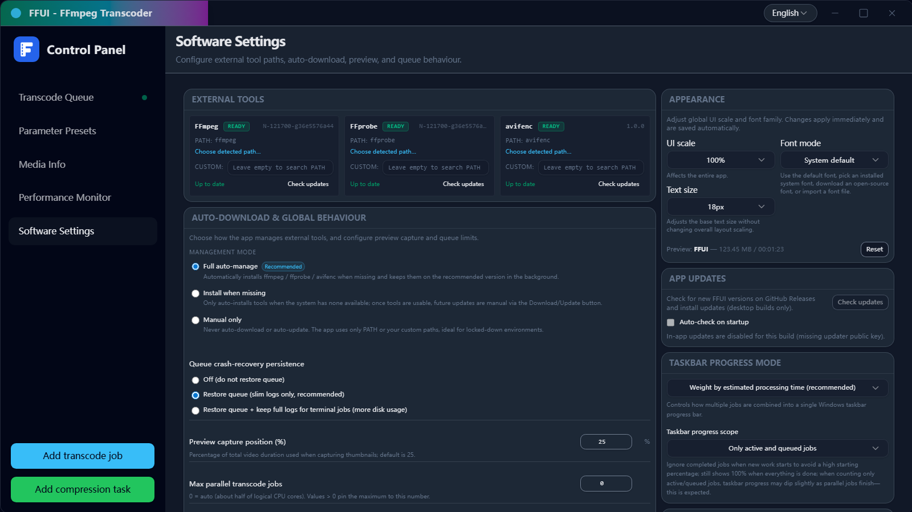

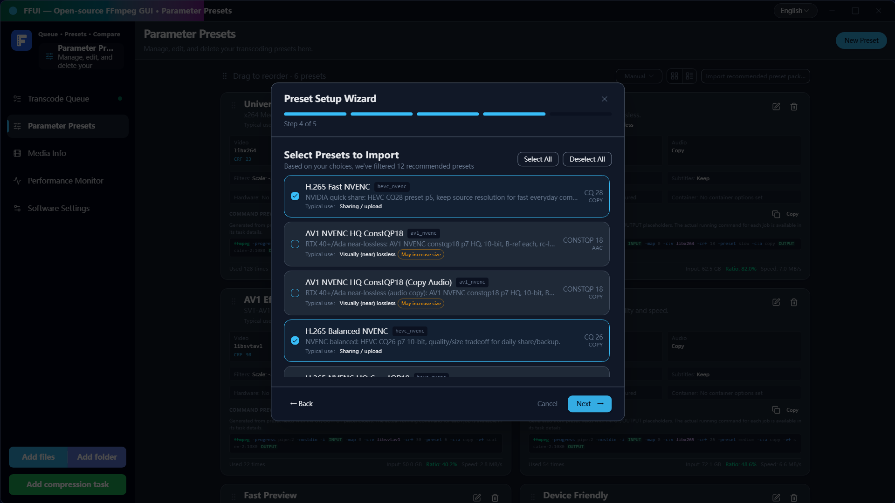

To refresh the UI screenshots after UI changes, run `pnpm run docs:screenshots`.
If Playwright browsers are not installed on this machine, run `pnpm exec playwright install`.

The script can use your local media folder to populate real filenames and preview thumbnails:

```bash
pnpm run docs:screenshots -- --media-dir "<YOUR_MEDIA_DIR>" --allow-video-thumbs
# Optional: override UI scale & text size for screenshots
pnpm run docs:screenshots -- --media-dir "<YOUR_MEDIA_DIR>" --allow-video-thumbs --ui-scale 110 --ui-font-size-px 20
# Optional: choose the frame timestamp for thumbnails (default: 00:05:00)
pnpm run docs:screenshots -- --media-dir "<YOUR_MEDIA_DIR>" --allow-video-thumbs --thumb-time 00:03:30
# Optional: choose the frame timestamp used for compare screenshots/GIF (default: --thumb-time)
pnpm run docs:screenshots -- --media-dir "<YOUR_MEDIA_DIR>" --allow-video-thumbs --compare-thumb-time 00:04:10
# Optional: force compare output format (default: gif)
pnpm run docs:screenshots -- --media-dir "<YOUR_MEDIA_DIR>" --allow-video-thumbs --compare-format webp
```

## Technology stack

- Frontend: Vue 3, TypeScript, Vite, Tailwind-style styling, vue-i18n, charts via ApexCharts / ECharts.
- Backend: Tauri 2 with Rust 2024 edition, queue and preset engine under `src-tauri/src/ffui_core`.
- Monitoring: system metrics gathered with `sysinfo`, optional GPU metrics via `nvml-wrapper`.

## Prerequisites

To build and run the desktop app you need:

- A Rust toolchain (stable) with Cargo.
- Node.js (Corepack enabled) and pnpm.
- The Tauri 2 CLI and its platform-specific prerequisites (see the Tauri documentation).

## Getting started

Clone this repository and install the JavaScript dependencies:

```bash
corepack enable
pnpm install
```

### Frontend-only development

Run the Vite dev server and open the web UI in a browser:

```bash
pnpm run dev
# default: http://localhost:5188
```

### Desktop app development (Tauri)

Build the frontend and start the Tauri dev window:

```bash
pnpm run tauri:dev
# equivalent to: vite build && tauri dev
```

Note: `tauri:dev` uses `vite build` for speed and does not run `vue-tsc`. Run `pnpm run build` for a strict type-checking build.

Tauri attaches to the dev server at `http://localhost:5188` as configured in `tauri.conf.json` and `vite.config.ts`.

### Building

Build the production frontend bundle:

```bash
pnpm run build
```

Build the Rust backend and desktop bundle:

```bash
cd src-tauri
cargo build        # debug build
cargo build --release
```

On platforms where the Tauri CLI is available you can also build the desktop binary (no installer bundles) from the repo root:

```bash
pnpm run build:exe
# runs: tauri build --no-bundle
```

### Release assets

GitHub Releases include the standard Tauri bundles for each platform. In addition, Windows releases include a portable single-file executable named like `FFUI-v<version>-windows-x64-portable.exe`.

### In-app updates (desktop)

FFUI can check for updates and install them in-app using Tauri's updater plugin. This requires signed updater artifacts.

- The updater flow applies to standard Tauri bundles (MSI/NSIS/AppImage/dmg). The extra Windows portable single-file executable is not updated in-place.
- Maintainers must configure signing keys:
  - Generate keys: `pnpm run tauri -- signer generate -w ~/.tauri/ffui-updater.key --ci`
  - Set `src-tauri/tauri.conf.json` `plugins.updater.pubkey` to the generated public key string
  - Set GitHub Actions secrets: `TAURI_SIGNING_PRIVATE_KEY` (and optional `TAURI_SIGNING_PRIVATE_KEY_PASSWORD`)
- Key storage & rotation:
  - Store the private key securely (password manager / vault). Losing it permanently breaks future updates for existing installs.
  - To rotate keys, ship a transitional release signed with the old key that embeds the new public key, then sign subsequent releases with the new key.

## Testing

The repository contains unit tests for both the frontend and the Rust backend.

- Frontend tests (Vitest):

```bash
# non-interactive (recommended for CI):
pnpm test
# interactive watch mode:
pnpm run test:watch
```

- Backend tests (Rust):

```bash
cd src-tauri
cargo test
```

## Security audit

Some registry mirrors may cause redirect loops for `pnpm audit`. Use the built-in script which pins the official npm registry:

```bash
pnpm run audit:json
```

## Dependency updates

Use `pnpm outdated` to review upgrades. Prefer patch/minor updates first; for major updates (e.g. Vite 7) open a dedicated change proposal and run full regression (at least `pnpm run check:all`, and Tauri smoke via `pnpm run tauri:dev`).

## Duplicate code detection

The repository includes basic duplicate-code checks for both frontend and backend (jscpd):

```bash
# Frontend (jscpd), reports in .jscpd/
pnpm run dup:frontend

# Backend (Rust, jscpd), reports in .jscpd/
pnpm run dup:rust

# Run both
pnpm run dup:all
```

## Queue performance regression gates

The queue is performance-sensitive. The repo includes CI-friendly performance checks:

```bash
pnpm run bench:queue
```

See `docs/queue-performance.md` for the production queue performance design and tuning knobs.

## Directory layout

- `src/` – Vue 3 frontend.
  - `components/` – UI components and panels (queue, presets, media, monitor, settings, dialogs).
  - `composables/` – state and behaviour hooks (queue operations, batch compress, system metrics, settings, etc.).
  - `lib/` – frontend helpers such as backend bindings, FFmpeg command rendering, and preset utilities.
  - `locales/` – i18n resources for English and Simplified Chinese.
- `src-tauri/` – Tauri 2 Rust backend.
  - `src/ffui_core/` – transcoding engine, presets, batch compress, settings, external tools, and monitoring logic.
  - `src/commands/` – Tauri commands exposed to the frontend.
  - `src/system_metrics.rs` – system metrics sampler and history buffer.
- `docs/` – notes about FFmpeg parameter space and internal design.
- `public/` – static assets.
- `dist/` – production frontend build output (generated).
- `scripts/` – helper scripts for development and build.

## System performance monitoring

The app includes a “Monitor” tab that displays system metrics from the Rust backend.

### Backend sampling configuration

System metrics are sampled in `src-tauri/src/system_metrics.rs` using `sysinfo` and optionally NVML. Sampling behaviour can be tuned through environment variables:

- `FFUI_METRICS_INTERVAL_MS`  
  Base sampling interval in milliseconds. The sampler always uses this interval (or the user-configured value in `AppSettings`) between snapshots.  
  Default: `1000`.

- `FFUI_METRICS_IDLE_INTERVAL_MS`  
  Reserved for potential future “idle” throttling when no subscribers are present. The current implementation does not use this value directly.  
  Default: `5000`.

- `FFUI_METRICS_HISTORY_CAPACITY`  
  Maximum number of snapshots kept in the in-memory ring buffer. Older entries are dropped when the limit is exceeded.  
  Default: `600` (roughly 10 minutes at 1s intervals).

- `FFUI_METRICS_MAX_DISKS`  
  Maximum number of disk devices to keep in the I/O metrics list.  
  Default: `6`.

- `FFUI_METRICS_MAX_INTERFACES`  
  Maximum number of network interfaces to keep in the metrics list.  
  Default: `6`.

The effective sampling interval may also be overridden at runtime via the `metrics_interval_ms` field in `AppSettings`, which is controlled from the Settings panel.

### Frontend metrics panel

The `Monitor` tab is implemented with:

- `useSystemMetrics` (`src/composables/useSystemMetrics.ts`), which:
  - subscribes to the `system-metrics://update` event in Tauri mode;
  - keeps a bounded snapshot history (default length 600);
  - falls back to a mock data stream in pure web / test environments.
- `MonitorPanelPro.vue` (`src/components/panels/MonitorPanelPro.vue`), which renders:
  - overall CPU utilisation and per-core heatmaps (up to 32 cores);
  - memory usage;
  - aggregated disk read/write throughput;
  - per-interface network throughput;
  - optional NVIDIA GPU usage and memory usage when available.

## External tools and FFmpeg

FFUI does not ship its own codecs. It relies on external command-line tools:

- `ffmpeg`
- `ffprobe`
- `avifenc`

The backend can use binaries found on the system `PATH` or, when auto-download is enabled, fetch static builds from configured sources and record basic metadata. Configuration for these tools, including custom paths and auto-download behaviour, is managed through the Settings panel and stored in `AppSettings`.

The exact download sources and policies are implemented in `src-tauri/src/ffui_core/tools/`.

## License

This project is licensed under the MIT License. See `LICENSE` for details.

---

## 项目简介

FFUI 是一款桌面端的视频转码/压缩工具：把文件拖进任务队列，选个预设就能开始批量转码。它主打“队列 + 预设”工作流，内置预设统计和输入/输出帧对比，帮助你更快找到顺手的参数组合。它基于 FFmpeg，但你不必先学命令行；如果你熟悉 FFmpeg，也可以把预设当作可复用的“参数模板库”，随时细调并复用。

> FFUI 正在积极开发中。欢迎任何建议、问题反馈与贡献：可以在 GitHub 提 [Issue](https://github.com/muyuanjin/ffui/issues)，也欢迎直接提 [Pull Request](https://github.com/muyuanjin/ffui/pulls)。

## 首次使用

1. 从 GitHub Releases 下载最新版本。
2. 首次启动会弹出“预设引导”，根据你的硬件能力与用途帮你导入一套推荐的 FFmpeg 参数预设；后续也可以在“预设”页点击“导入推荐预设包…”单独打开，并导入更多预设。
3. 在队列页添加/拖拽任务，选择预设并开始。

小贴士：如果你没有安装 FFmpeg，可在“设置 → 外部工具”里开启自动下载/自动更新。

## 功能概览

- 任务队列：添加任务或通过批量压缩扫描目录入队，查看进度、状态与日志（支持可选的崩溃恢复）。
- 参数预设（含统计）：为视频/图片/音频管理可复用的预设，并查看使用次数、平均压缩率与速度统计。
- 输出对比：输入 vs 输出的同步播放/帧截图对比，快速检查画质差异。
- FFmpeg 管理：可自动下载/自动更新 FFmpeg（以及 `ffprobe` / `avifenc`），也支持手动指定本机路径。
- 批量压缩：按目录扫描媒体文件，基于体积和编码规则筛选候选文件并批量加入队列。
- 媒体信息：针对单个文件查看由后端返回的结构化元数据和分析结果。
- 性能监控：在“性能监控”页中查看 CPU、内存、磁盘 I/O、网络 I/O 以及可选的 NVIDIA GPU 指标。
- 设置：可配置输出规则、外观设置（字体/缩放）、预览截帧位置、并行任务上限、采样间隔等。

## 界面截图

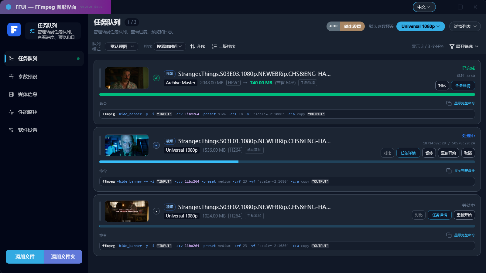

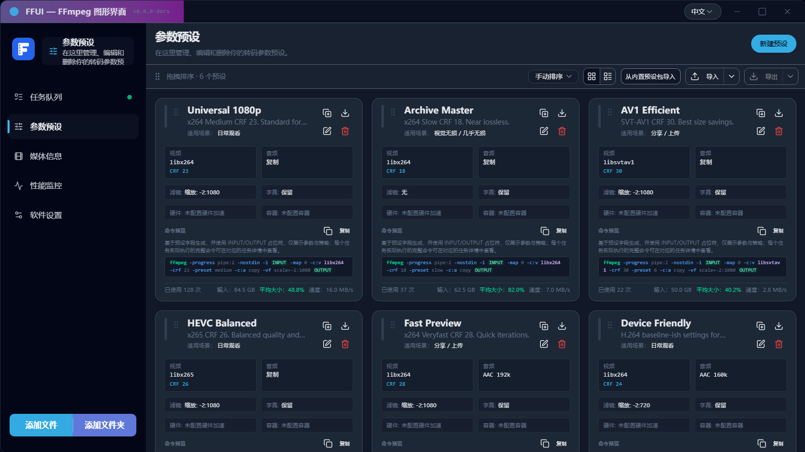

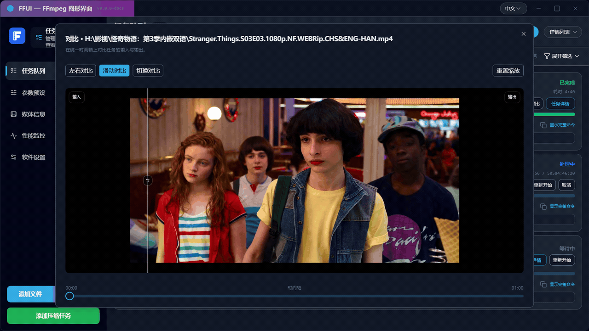

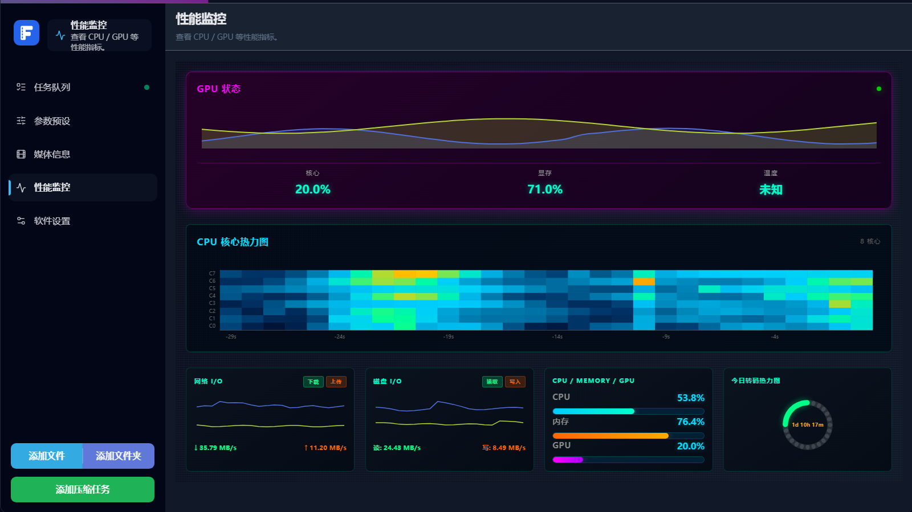

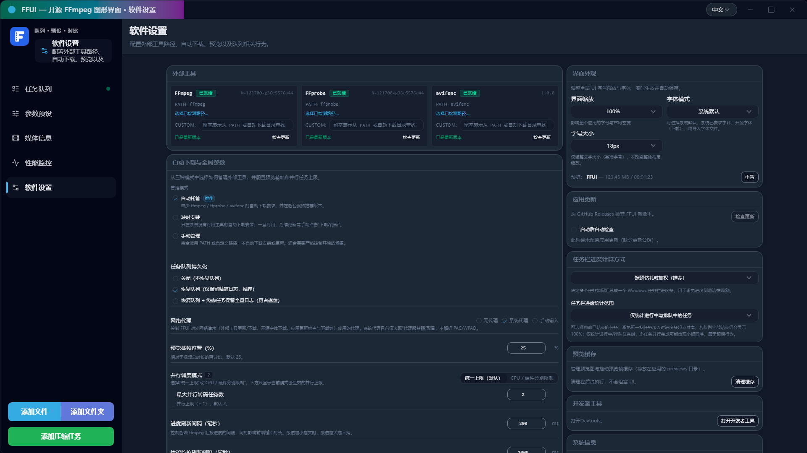

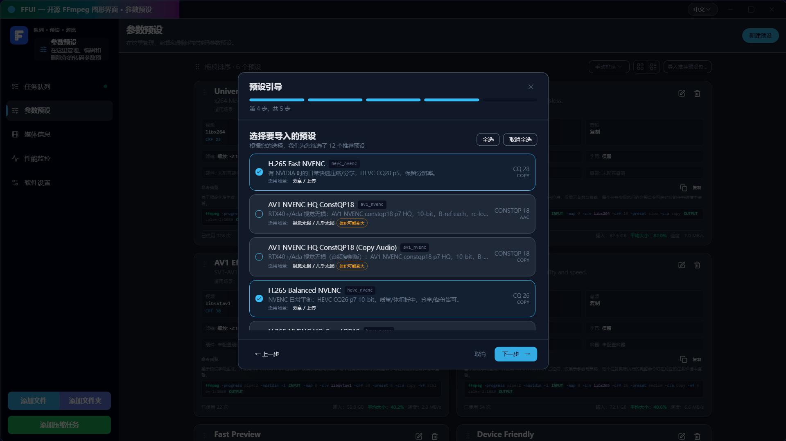

修改 UI 后可用 `pnpm run docs:screenshots` 自动重新生成界面截图。
首次在本机运行该脚本时，如未安装 Playwright 浏览器，请先执行 `pnpm exec playwright install`。

脚本可以读取你的本地影视目录来填充真实文件名，并从视频中截帧生成预览图：

```bash
pnpm run docs:screenshots -- --media-dir "<YOUR_MEDIA_DIR>" --allow-video-thumbs
# 可选：覆盖截图用的界面缩放与字号
pnpm run docs:screenshots -- --media-dir "<YOUR_MEDIA_DIR>" --allow-video-thumbs --ui-scale 110 --ui-font-size-px 20
# 可选：指定截帧时间点（默认：00:05:00）
pnpm run docs:screenshots -- --media-dir "<YOUR_MEDIA_DIR>" --allow-video-thumbs --thumb-time 00:03:30
```

## 技术栈

- 前端：Vue 3、TypeScript、Vite、Tailwind 风格样式、vue-i18n，图表使用 ApexCharts / ECharts。
- 后端：Tauri 2 + Rust 2024，队列和预设引擎位于 `src-tauri/src/ffui_core`。
- 监控：系统指标通过 `sysinfo` 采样，在支持的环境下使用 `nvml-wrapper` 获取 GPU 指标。

## 环境依赖

构建并运行桌面应用需要：

- 已安装的 Rust 工具链（稳定版）及 Cargo。
- Node.js（启用 Corepack）与 pnpm。
- Tauri 2 CLI 以及平台相关依赖（可参考 Tauri 官方文档）。

## 快速开始

在仓库根目录执行：

```bash
corepack enable
pnpm install
```

### 仅运行前端（浏览器）

```bash
pnpm run dev
# 默认开发地址： http://localhost:5188
```

### 运行桌面应用（Tauri）

```bash
pnpm run tauri:dev
# 等价于：vite build && tauri dev
```

注意：`tauri:dev` 为了速度使用 `vite build`，不会运行 `vue-tsc` 类型检查；如需严格构建请使用 `pnpm run build`。

Tauri 会连接到 `tauri.conf.json` 和 `vite.config.ts` 中配置的 `http://localhost:5188` 前端开发服务。

### 构建

构建生产环境前端资源：

```bash
pnpm run build
```

单独构建 Rust 后端：

```bash
cd src-tauri
cargo build          # 调试构建
cargo build --release
```

在支持 Tauri CLI 的平台上，也可以从仓库根目录构建桌面可执行文件（不打包安装器）：

```bash
pnpm run build:exe
# 实际执行：tauri build --no-bundle
```

### Release 产物

GitHub Releases 会包含各平台的标准 Tauri 安装包/构建产物；此外，Windows 会额外上传一个绿色便携版单文件可执行程序，命名类似 `FFUI-v<version>-windows-x64-portable.exe`。

### 应用内更新（桌面）

FFUI 支持使用 Tauri 官方 updater 插件在应用内检查更新并安装（需要签名）。

- 仅适用于标准 Tauri 安装包/构建产物（MSI/NSIS/AppImage/dmg）；Windows 额外上传的绿色便携版单文件 exe 不支持原地自更新。
- 维护者需要配置签名密钥：
  - 生成密钥：`pnpm run tauri -- signer generate -w ~/.tauri/ffui-updater.key --ci`
  - 将生成的公钥内容填入 `src-tauri/tauri.conf.json` 的 `plugins.updater.pubkey`
  - 在 GitHub Actions 里配置 secrets：`TAURI_SIGNING_PRIVATE_KEY`（以及可选的 `TAURI_SIGNING_PRIVATE_KEY_PASSWORD`）
- 密钥保管与轮换：
  - 私钥务必安全保存（密码管理器/密钥库）。一旦丢失，已安装版本将无法继续接收更新。
  - 轮换密钥需先发布一个“过渡版本”（用旧私钥签名、内置新公钥），随后再用新私钥签名后续版本。

## 测试

仓库包含前端和后端的单元测试。

- 前端（Vitest）：

```bash
# 非交互单次运行（推荐 CI）：
pnpm test
# 交互 watch 模式：
pnpm run test:watch
```

- 后端（Rust）：

```bash
cd src-tauri
cargo test
```

## 安全审计

部分镜像源可能导致 `pnpm audit` 出现重定向死循环。请使用内置脚本（固定 npm 官方 registry）：

```bash
pnpm run audit:json
```

## 依赖更新

使用 `pnpm outdated` 查看更新建议。优先合并 patch/minor；大版本升级（例如 Vite 7）建议单独走变更提案，并跑全套回归（至少 `pnpm run check:all`，以及 `pnpm run tauri:dev` 做 Tauri 侧冒烟）。

## 代码重复检测

仓库内提供了前端/后端的重复代码检测命令：

```bash
# 前端（jscpd），报告输出在 .jscpd/
pnpm run dup:frontend

# 后端（Rust，jscpd），报告输出在 .jscpd/
pnpm run dup:rust

# 一次跑完两侧
pnpm run dup:all
```

## 目录结构

- `src/`：前端代码。
  - `components/`：界面组件与面板（队列、预设、媒体、监控、设置、弹窗等）。
  - `composables/`：状态与逻辑封装（队列操作、批量压缩、系统监控、设置等）。
  - `lib/`：前端辅助库，例如后端调用封装、FFmpeg 命令渲染、预设工具函数。
  - `locales/`：中英文文案资源。
- `src-tauri/`：Tauri 2 Rust 后端。
  - `src/ffui_core/`：转码引擎、预设管理、批量压缩、设置、外部工具和监控逻辑。
  - `src/commands/`：暴露给前端的 Tauri 命令。
  - `src/system_metrics.rs`：系统性能采样与历史缓冲。
- `docs/`：与 FFmpeg 参数空间相关的参考文档和内部笔记。
- `public/`：静态资源。
- `dist/`：前端构建输出（自动生成）。
- `scripts/`：开发与构建辅助脚本。

## 系统性能监控

应用包含一个“性能监控”页签，用于展示由 Rust 后端采样的系统指标。

### 后端采样配置

系统指标在 `src-tauri/src/system_metrics.rs` 中通过 `sysinfo` 和可选的 NVML 采样。采样行为可以通过以下环境变量调整：

- `FFUI_METRICS_INTERVAL_MS`  
  采样基础间隔（毫秒）。采样线程在每次快照之间始终按该间隔（或设置中的覆盖值）休眠。  
  默认：`1000`。

- `FFUI_METRICS_IDLE_INTERVAL_MS`  
  预留给“空闲状态降频”之类的策略，目前实现不会实际使用该值。  
  默认：`5000`。

- `FFUI_METRICS_HISTORY_CAPACITY`  
  环形缓冲区中保留的最大快照条数，超出上限时丢弃最旧数据。  
  默认：`600`（按 1 秒采样约 10 分钟历史）。

- `FFUI_METRICS_MAX_DISKS`  
  磁盘 I/O 指标中保留的设备数量上限。  
  默认：`6`。

- `FFUI_METRICS_MAX_INTERFACES`  
  网络 I/O 指标中保留的网卡数量上限。  
  默认：`6`。

此外，设置中的 `metrics_interval_ms` 字段也可以在运行时覆盖采样间隔，可通过设置页进行调整。

### 前端性能面板

性能监控相关前端代码主要包括：

- `useSystemMetrics`（`src/composables/useSystemMetrics.ts`）：
  - 在 Tauri 模式下订阅 `system-metrics://update` 事件；
  - 维护一个有上限的历史快照（默认长度 600）；
  - 在纯 Web / 测试环境下使用模拟数据源。
- `MonitorPanelPro.vue`（`src/components/panels/MonitorPanelPro.vue`）：
  - 展示整体 CPU 利用率与最多 32 个核心的热力图；
  - 展示内存占用；
  - 展示聚合磁盘读写吞吐；
  - 展示按接口分组的网络吞吐；
  - 在可用时展示 NVIDIA GPU 利用率和显存使用率。

## 外部工具与 FFmpeg

FFUI 不自带编解码器实现，依赖外部命令行工具：

- `ffmpeg`
- `ffprobe`
- `avifenc`

后端可以使用系统 `PATH` 中已有的可执行文件，也可以在开启自动下载后，根据设置从外部来源获取静态构建版本，并记录基本元数据。相关配置（自定义路径、自动下载策略等）通过设置页管理，并保存在 `AppSettings` 中。

具体的下载来源和策略实现位于 `src-tauri/src/ffui_core/tools/` 下的代码中，可按需要自行查看。

## 许可证

本项目采用 MIT 许可证，详情见仓库中的 `LICENSE` 文件。
